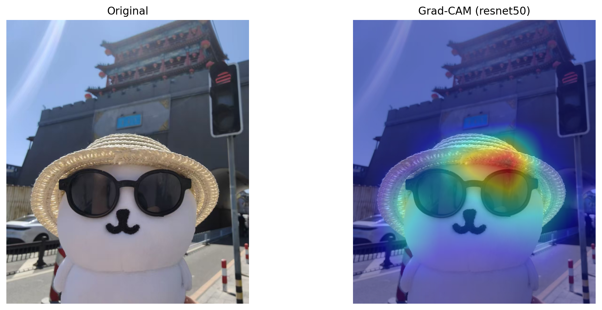
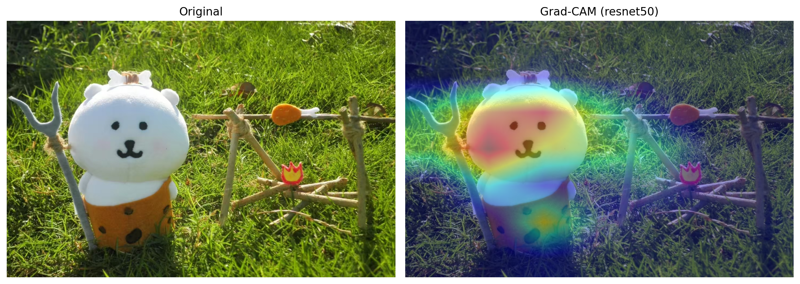

# Grad-CAM AI 视觉焦点可视化工具
# 1. 项目简介

**Grad-CAM AI 视觉焦点可视化工具**



​	本项目为**深度学习课程设计**，基于 PyTorch + PyQt5 实现 Grad-CAM 系列算法可视化工具，用于**解析图像分类模型的可解释性**。 工具支持主流卷积网络、视觉Transformer模型，提供单图分析、批量处理、视频/摄像头实时分析、多算法对比等完整功能，直观展示AI模型的视觉关注区域。

### 技术栈 ：

- 编程语言：Python 3.10 
- 深度学习框架：PyTorch 2.0.1
- GUI框架：PyQt5
- 图像处理：OpenCV、Pillow、NumPy
- 核心算法：Grad-CAM、Grad-CAM++
- 依赖管理：Anaconda

### 2. 安装依赖包

```
pip install -r requirements.txt
```

`requirements.txt` 包含：

```
pyqt5>=5.15.9
opencv-python>=4.8.1.36
matplotlib>=3.7.1
pillow>=10.0.1
numpy>=1.24.3
scipy>=1.10.1
pyyaml>=6.0
tqdm>=4.66.1
pytorch-grad-cam
```

### 3. 硬件 & 框架版本

- CUDA：11.8（可选，无 CUDA 自动使用 CPU）
- TorchVision：对应 PyTorch 版本

## 项目目录结构

```
Grad-Cam_Visualizer/
├── assets/                # 资源目录
│   ├── input/             # 输入图片
│   ├── output/            # 输出热力图 & 结果图
│   └── temp/              # 临时文件
├── core/                  # 核心逻辑
│   ├── __init__.py
│   ├── cam_engine.py      # Grad-CAM算法核心
│   ├── config.py          # 全局配置
│   ├── image_process.py   # 图像预处理
│   ├── image_io.py        # 图片读取工具
│   ├── metrics.py         # 量化评估指标
│   └── model_zoo.py       # 模型加载
├── ui/                    # 界面代码
│   ├── __init__.py
│   ├── main_window.py     # 主窗口
│   ├── logic_basic.py     # 基础功能界面
│   ├── logic_advanced.py  # 进阶功能界面
│   └── widgets.py         # 自定义控件
├── docs/                  # 课程设计文档
│   ├── 项目说明书.md
│   ├── 原理解析.md
│   ├── 课程设计总结.md
│   └── 实验结果记录.md
├── model/                 # 预训练模型缓存目录
├── main.py                # 程序入口
├── requirements.txt       # 依赖清单
└── README.md              # 项目说明
```

## 功能清单

### 一、基础功能（单张图片分析）

1. 加载预训练模型：ResNet50、VGG16、ViT-B/16
2. 单张图片上传与预处理
3. Grad-CAM 热力图生成、原图与热力图对比展示
4. 结果自动保存至输出目录

### 二、进阶功能



1. **批量图片处理**：批量生成多张图片热力图并导出
2. **视频分析**：读取本地视频，逐帧生成热力图，支持暂停 / 播放
3. **摄像头实时分析**：调用本地摄像头，实时可视化模型关注区域
4. **多算法对比**：同一图片并行展示 `原图 / Grad-CAM / Grad-CAM++` 三种效果，直观对比算法差异

## 运行方式

1. 打开 Anaconda 终端，激活环境：

   bash

   ```
   conda activate gradcam
   ```

2. 进入项目根目录，执行入口文件：

   bash

   ```
   python main.py
   ```

3. 程序启动后分为两大选项卡：

   - 基础功能：单张图片热力图生成
   - 进阶功能：批量、视频、摄像头、多算法对比

## 使用说明

1. **模型加载**：在进阶功能左侧下拉框选择模型，点击「加载模型」；
2. **图片 / 视频选择**：点击对应按钮选择本地文件；
3. **算法对比**：选择图片后，界面自动分栏展示原图与两种算法热力图，标签清晰区分；
4. 所有生成结果自动保存至 `assets/output` 目录。

## 常见问题

1. `pytorch-grad-cam` 包安装失败

   正确安装命令：

   ```
   pip install grad-cam
   ```

2. 摄像头 / 视频卡死：降低帧率、关闭后台占用程序；

3. 梯度报错：确保模型未被永久锁定在 `no_grad` 模式（代码已做兼容）。